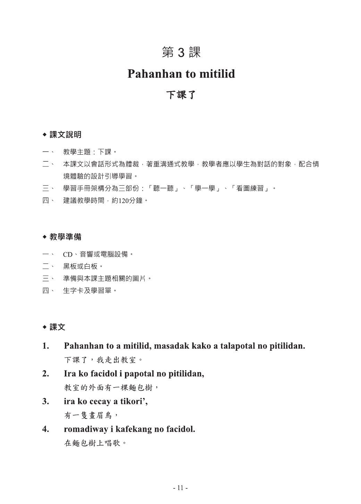
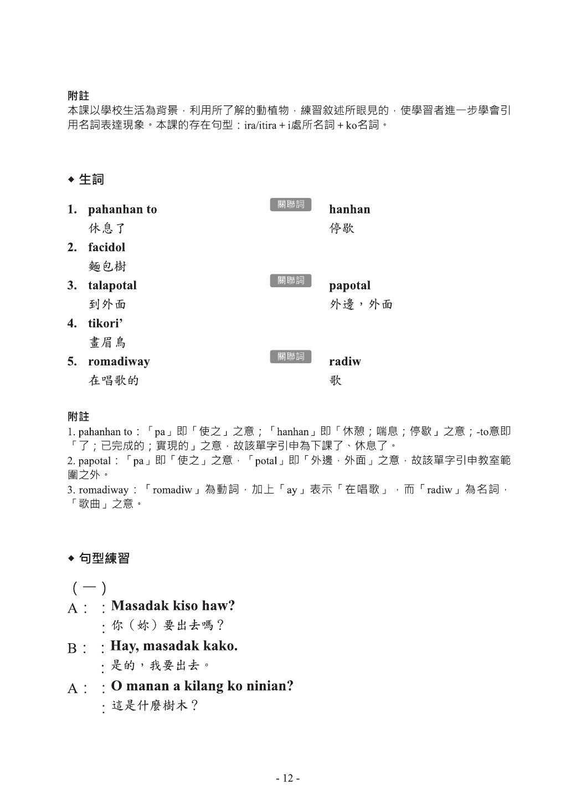
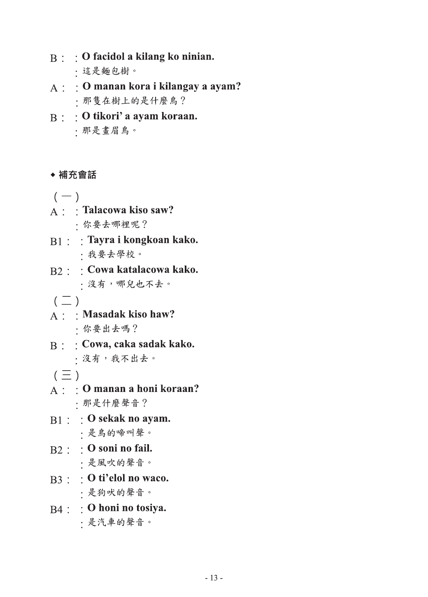
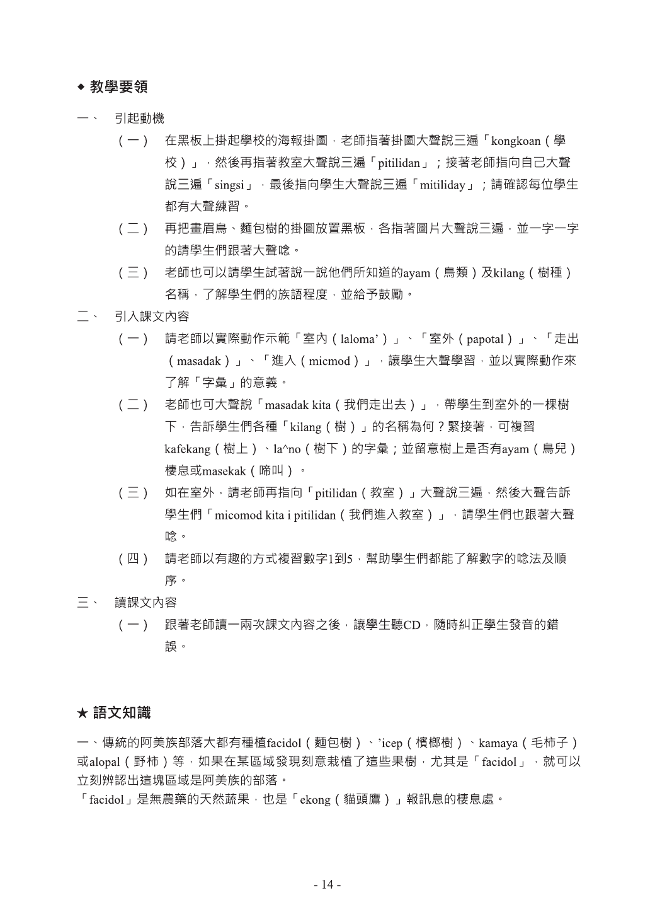
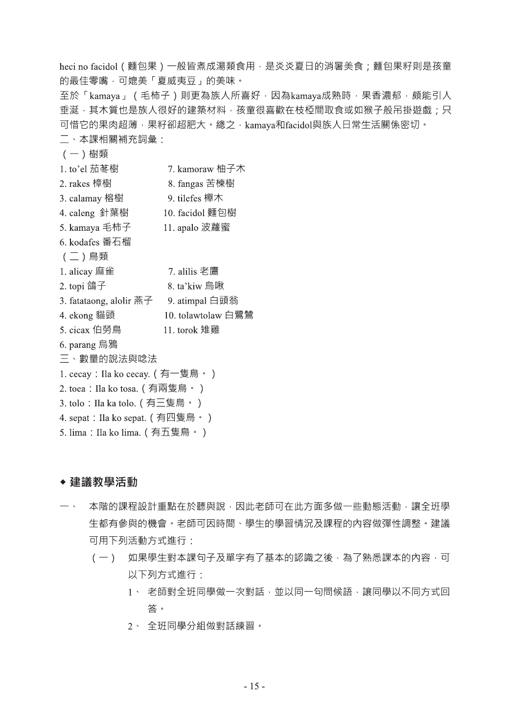
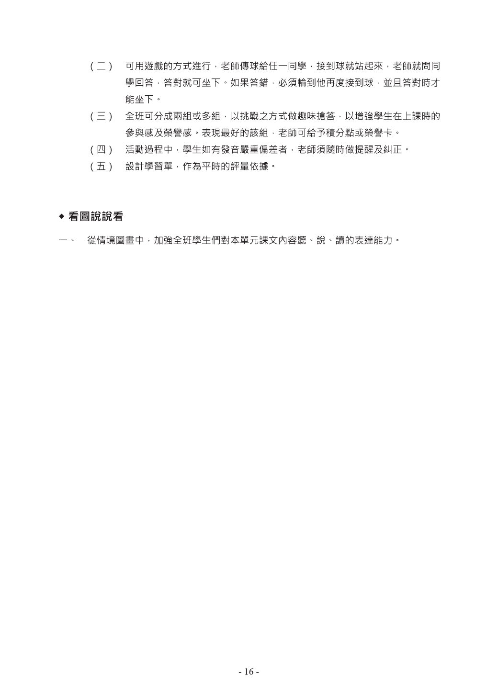

# 馬蘭 教師3階｜第 3 課｜Pasabek ko codad.

> 來源：`馬蘭 教師3階.pdf`
> PDF 頁面：第 15-20 頁
> 轉換狀態：此 PDF 為掃描圖像型檔案，目前先提供「Markdown + 頁面圖片」版本，方便學員選課與貼入 AI 工作台。若需要全文文字版，需再進行 OCR。

## 使用方式

1. 先閱讀本課頁面圖片。
2. 將本 Markdown 檔或本課頁面圖片上傳/貼到 Gemini、NotebookLM 或教案工作台。
3. 請 AI 只根據本課內容整理「核心單字、課文、句型、文化重點、課綱對應」。
4. 不可讓 AI 自行預設族別、語別或補寫教材中沒有的內容。

## 給 AI 的分析提示詞

請只根據我提供的「馬蘭 教師3階 第 3 課」教材內容進行分析，不要自行編造課文、單字、文化背景，也不要改成其他族語或族別。

請輸出：

1. 核心單字表：族語、中文解釋、關聯詞。
2. 課文內容：整理本課可辨識的課文與對話。
3. 句型公式：列出本課主要句型，並只使用教材中可見例句。
4. 文化小百科：整理本課文化或生活情境重點。
5. 課綱對應建議：對應原住民族語文課綱的核心素養、學習表現、學習內容。
6. 資料不足處：若圖片解析不足或看不清楚，請列出需要教師補充的頁面或欄位。

## 教材頁面

